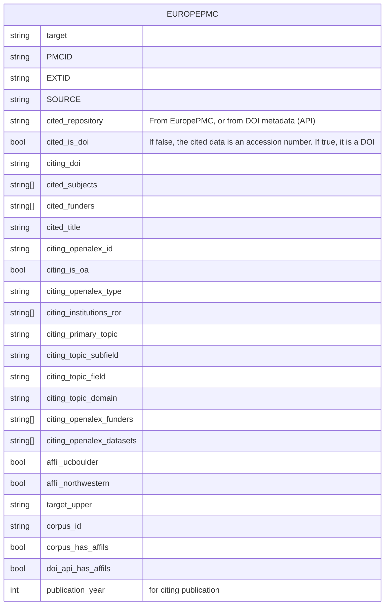

# Data Citation Corpus Analysis for Presentations

## ACRL 2025 Poster

### Data citations for University of Colorado, Boulder and Northwestern University

We are bringing in citations from Europe PMC.

