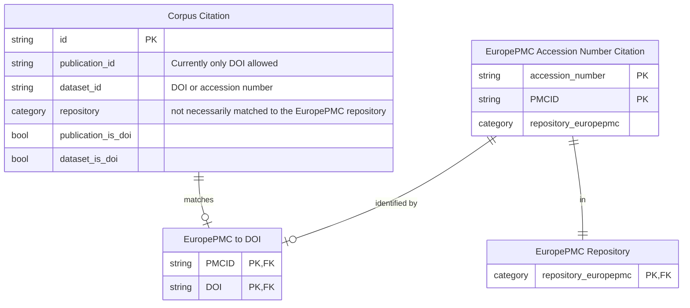

# EuropePMC Data Citations

+ Bulk downloads from EuropePMC are available here: <https://europepmc.org/downloads>
  + This includes data files of "accession numbers in Europe PMC articles": <https://europepmc.org/ftp/TextMinedTerms>
  + If you are using an ftp client you can use this address to download all of them: <ftp://ftp.ebi.ac.uk>
  + It says that these are updated weekly, though I would want to verify that.
  + There are 52 data files in this folder, organized by repository.

## Data model and entity relationships

Relationships are drawn using [crow's foot notation](https://en.wikipedia.org/wiki/Entity%E2%80%93relationship_model#Crow's_foot_notation).